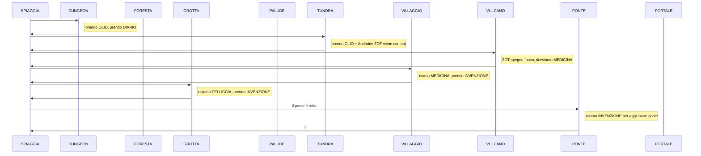
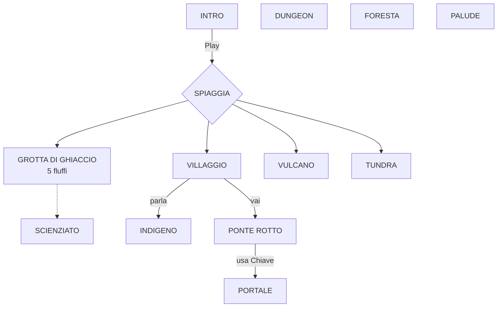

# 7 FRAMES - Flow

```mermaid
sequenceDiagram
    participant SPIAGGIA
    participant DUNGEON
    participant FORESTA
    participant GROTTA
    participant PALUDE
    participant TUNDRA
    participant VILLAGGIO
    participant VULCANO
    participant PONTE
    participant PORTALE

    SPIAGGIA->>DUNGEON:  
    Note right of DUNGEON: prendo OLIO, prendo DIARIO
    DUNGEON->>SPIAGGIA:  

    SPIAGGIA->>TUNDRA:  
    Note right of TUNDRA: prendo OLIO + Androide ZOT viene con noi
    TUNDRA->>SPIAGGIA:  

    SPIAGGIA->>VULCANO:  
    Note right of VULCANO: ZOT spegne fuoco, riceviamo MEDICINA
    VULCANO->>SPIAGGIA:  

    SPIAGGIA->>VILLAGGIO:  
    Note right of VILLAGGIO: diamo MEDICINA, prendo INVENZIONE
    VILLAGGIO->>SPIAGGIA:  

    SPIAGGIA->>GROTTA:  
    Note right of GROTTA: usiamo PELLICCIA, prendo INVENZIONE
    GROTTA->>SPIAGGIA:  

    SPIAGGIA->>PONTE: il ponte è rotto
    Note right of PONTE: usiamo INVENZIONE per aggiustare ponte
    PONTE->>SPIAGGIA:  f
```

```mermaid
graph TD

INTRO
SPIAGGIA{SPIAGGIA}
GROTTA["GROTTA DI GHIACCIO<br>5 fluffi"]
VILLAGGIO
DUNGEON
FORESTA
PALUDE
VULCANO
TUNDRA

INTRO -->|Play| SPIAGGIA

SPIAGGIA --> TUNDRA
SPIAGGIA --> VILLAGGIO
SPIAGGIA --> VULCANO
SPIAGGIA --> GROTTA

GROTTA -.-> SCIENZIATO

VILLAGGIO --> |parla| INDIGENO
VILLAGGIO --> |vai| PONTE[PONTE ROTTO]


PONTE --> |usa Chiave| PORTALE
```
