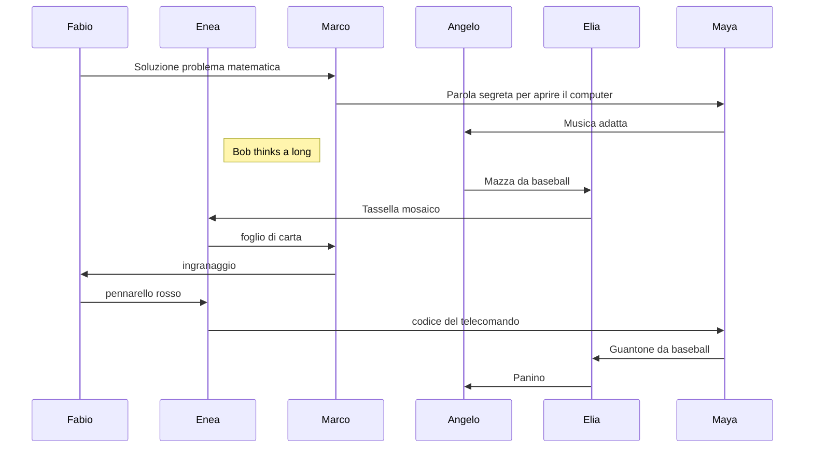
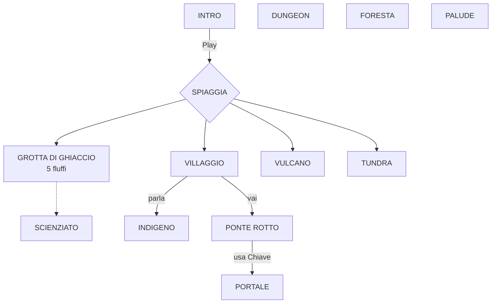

# 7 FRAMES - Flow

```mermaid
sequenceDiagram
    participant Fabio
    participant Enea
    participant Marco
    participant Angelo
    participant Elia
    participant Maya

    Fabio->>Marco: Soluzione problema matematica
    Marco->>Maya: Parola segreta per aprire il computer
    Maya->>Angelo: Musica adatta
    Note left of Marco: Bob thinks a long

    Angelo->>Elia: Mazza da baseball
    Elia->>Enea:Tassella mosaico
    Enea->>Marco: foglio di carta
    Marco->>Fabio: ingranaggio
    Fabio->>Enea: pennarello rosso
    Enea->>Maya: codice del telecomando
    Maya->>Elia: Guantone da baseball
    Elia->>Angelo: Panino

```

```mermaid
graph TD

INTRO
SPIAGGIA{SPIAGGIA}
GROTTA["GROTTA DI GHIACCIO<br>5 fluffi"]
VILLAGGIO
DUNGEON
FORESTA
PALUDE
VULCANO
TUNDRA

INTRO -->|Play| SPIAGGIA

SPIAGGIA --> TUNDRA
SPIAGGIA --> VILLAGGIO
SPIAGGIA --> VULCANO
SPIAGGIA --> GROTTA

GROTTA -.-> SCIENZIATO

VILLAGGIO --> |parla| INDIGENO
VILLAGGIO --> |vai| PONTE[PONTE ROTTO]


PONTE --> |usa Chiave| PORTALE

```
